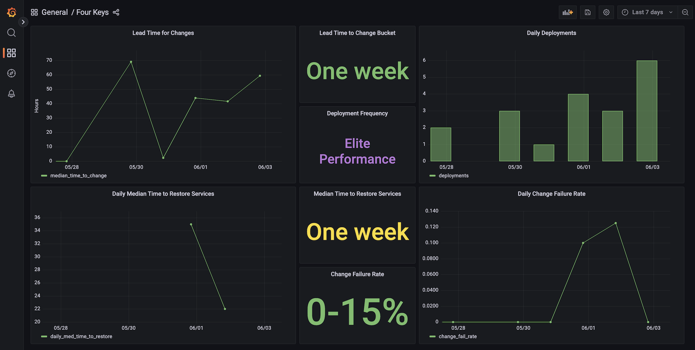
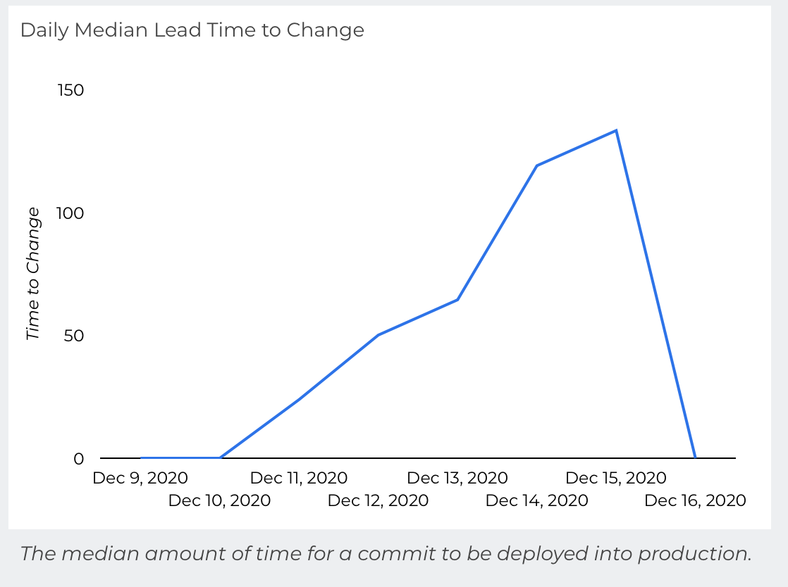
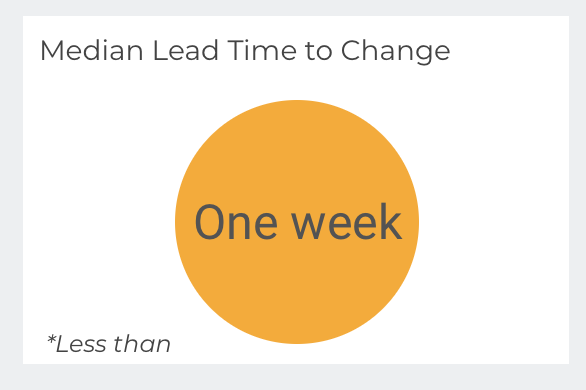
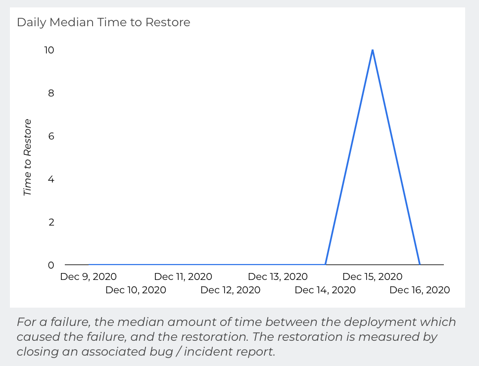
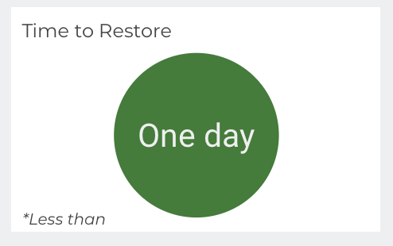
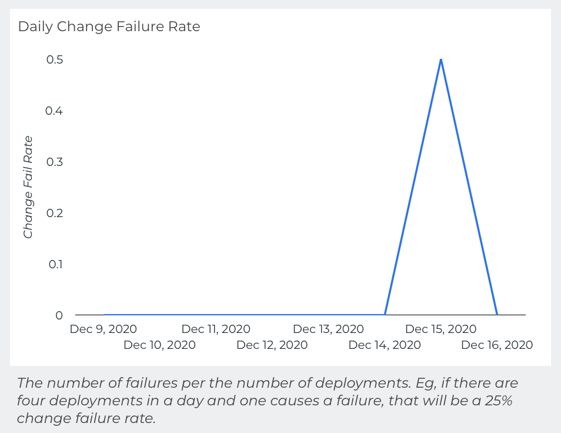
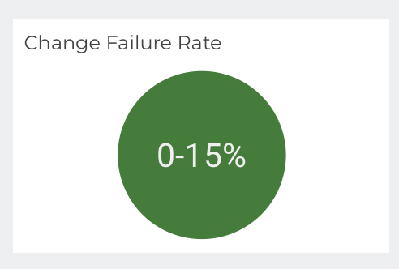

# Four Key Metrics Calculations

This page describes the calculation of each metric that the Four Keys dashboard displays. Read this page if you are contributing to the source code for the metrics calculation, or if you want details about the source of each metric.



For each of the metrics, the dashboard shows a running daily calculation, as well as a 3 month bucketed view.  The  buckets are categorized per the [2019 State of DevOps Report](https://www.devops-research.com/research.html#reports). 

## Deployment Frequency ##

**Definition**: How frequently a team successfully releases to production, e.g., daily, weekly, monthly, yearly. 

### Daily Deployment Volumes ###


This is the simplest of the charts to create, with a very straightforward script.  We simply want the daily volume of distinct deployments.


```sql
SELECT
TIMESTAMP_TRUNC(time_created, DAY) AS day,
COUNT(distinct deploy_id) AS deployments
FROM
four_keys.deployments
GROUP BY day;
```

### Calculating the bucket ### 


Here we see more complexity.  The first thing to consider is that we need rows for the days with no deployments. To achieve this, we unpack a date array to join against our table, which will create Null values for days without deployments.

```sql
WITH last_three_months AS
(SELECT
TIMESTAMP(day) AS day
FROM
UNNEST(
GENERATE_DATE_ARRAY(
    DATE_SUB(CURRENT_DATE(), INTERVAL 3 MONTH), CURRENT_DATE(),
    INTERVAL 1 DAY)) AS day
# FROM the start of the data
WHERE day > (SELECT date(min(time_created)) FROM four_keys.events_raw)
)

SELECT
last_three_months.day,
deploy_id
FROM last_three_months
LEFT JOIN(
  SELECT
  TIMESTAMP_TRUNC(time_created, DAY) AS day,
  deploy_id
  FROM four_keys.deployments) deployments ON deployments.day = last_three_months.day;
```

Now we have a full picture of the last three months and will use this to calculate the frequency.  To do this we have to decide what each bucket means.  

- **Daily**: Over the last three months, the median number of days per week with deployments is equal to or greater than three; ie, most working days have deployments.
- **Weekly**: Over the last three months, the median number of days per week with deployments is at least 1; ie, most weeks have at least one deployment.
- **Monthly**:  Over the last three months, the median number of deployments per month is at least 1; ie, most months have at least one deployment.
- **Yearly**: Any frequency slower than Monthly.  This is the else statement and will default to Yearly if the above conditions are not met. 

```sql
WITH last_three_months AS
(SELECT
TIMESTAMP(day) AS day
FROM
UNNEST(
GENERATE_DATE_ARRAY(
    DATE_SUB(CURRENT_DATE(), INTERVAL 3 MONTH), CURRENT_DATE(),
    INTERVAL 1 DAY)) AS day
# FROM the start of the data
WHERE day > (SELECT date(min(time_created)) FROM four_keys.events_raw)
)

SELECT
CASE WHEN daily THEN "Daily" 
     WHEN weekly THEN "Weekly" 
      # If at least one per month, then Monthly
     WHEN PERCENTILE_CONT(monthly_deploys, 0.5) OVER () >= 1 THEN  "Monthly" 
     ELSE "Yearly"
     END as deployment_frequency
FROM (
  SELECT
  # If the median number of days per week is more than 3, then Daily
  PERCENTILE_CONT(days_deployed, 0.5) OVER() >= 3 AS daily,
  # If most weeks have a deployment, then Weekly
  PERCENTILE_CONT(week_deployed, 0.5) OVER() >= 1 AS weekly,

  # Count the number of deployments per month.  
  # Cannot mix aggregate and analytic functions, so calculate the median in the outer select statement
  SUM(week_deployed) OVER(partition by TIMESTAMP_TRUNC(week, MONTH)) monthly_deploys
  FROM(
      SELECT
      TIMESTAMP_TRUNC(last_three_months.day, WEEK) as week,
      MAX(if(deployments.day is not null, 1, 0)) as week_deployed,
      COUNT(distinct deployments.day) as days_deployed
      FROM last_three_months
      LEFT JOIN(
        SELECT
        TIMESTAMP_TRUNC(time_created, DAY) AS day,
        deploy_id
        FROM four_keys.deployments) deployments ON deployments.day = last_three_months.day
      GROUP BY week)
 )
LIMIT 1;
```

## Lead Time for Changes ##

**Definition**: The median amount of time for a commit to be deployed into production.

### Daily Median Lead Time ###



If we have a list of all changes for every deployment, it is simple to calculate the lead time for each change to deployment.

```sql
SELECT
  d.deploy_id,
  TIMESTAMP_TRUNC(d.time_created, DAY) AS day,
  #### Time to Change
  TIMESTAMP_DIFF(d.time_created, c.time_created, MINUTE) AS time_to_change_minutes
FROM four_keys.deployments d, d.changes
LEFT JOIN four_keys.changes c ON changes = c.change_id;
```

From this base, we want to extract the daily median lead time to change. 

```sql
SElECT
  day,
  median_time_to_change
FROM (
  SELECT
    day,
    PERCENTILE_CONT(
      # Ignore automated changes
      IF(time_to_change_minutes > 0, time_to_change_minutes, NULL), 
      0.5) # Median
      OVER (partition by day) AS median_time_to_change
  FROM (
    SELECT
      d.deploy_id,
      TIMESTAMP_TRUNC(d.time_created, DAY) AS day,
      # Time to Change
      TIMESTAMP_DIFF(d.time_created, c.time_created, MINUTE) AS time_to_change_minutes
    FROM four_keys.deployments d, d.changes
    LEFT JOIN four_keys.changes c ON changes = c.change_id
  )
)
GROUP BY day, median_time_to_change;
```

Here is how we write it more efficiently for the dashboard.

```sql
SELECT
  day,
  IFNULL(ANY_VALUE(med_time_to_change)/60, 0) AS median_time_to_change, # Hours
FROM (
  SELECT
    d.deploy_id,
    TIMESTAMP_TRUNC(d.time_created, DAY) AS day,
    PERCENTILE_CONT(
      # Ignore automated pushes
      IF(TIMESTAMP_DIFF(d.time_created, c.time_created, MINUTE) > 0, TIMESTAMP_DIFF(d.time_created, c.time_created, MINUTE), NULL),
      0.5) # Median
      OVER (PARTITION BY TIMESTAMP_TRUNC(d.time_created, DAY)) AS med_time_to_change, # Minutes
  FROM four_keys.deployments d, d.changes
  LEFT JOIN four_keys.changes c ON changes = c.change_id
)
GROUP BY day ORDER BY day;
```

Automated changes are excluded from this metric.  This is a subject up for debate. Our rationale is that when we merge a Pull Request it creates a Push event in the main branch.  This Push event is not its own distinct change, but rather a link in the workflow.  If we trigger a deployment off of this push event, this artificially skews the metrics and does not give us a clear picture of developer velocity. 

### Calculating the bucket ###


To get the buckets, rather than aggregating daily, we look at the last 3 months and bucket the results according to the DORA research. 

```sql
SELECT 
  CASE
    WHEN median_time_to_change < 24 * 60 then "One day"
    WHEN median_time_to_change < 168 * 60 then "One week"
    WHEN median_time_to_change < 730 * 60 then "One month"
    WHEN median_time_to_change < 730 * 6 * 60 then "Six months"
    ELSE "One year"
    END as lead_time_to_change
FROM (
  SElECT
    IFNULL(ANY_VALUE(med_time_to_change), 0) AS median_time_to_change
  FROM (
    SELECT
      PERCENTILE_CONT(
        # Ignore automated pushes
        IF(TIMESTAMP_DIFF(d.time_created, c.time_created, MINUTE) > 0, TIMESTAMP_DIFF(d.time_created, c.time_created, MINUTE), NULL),
        0.5) # Median
        OVER () AS med_time_to_change, # Minutes
    FROM four_keys.deployments d, d.changes
    LEFT JOIN four_keys.changes c ON changes = c.change_id
    WHERE d.time_created > TIMESTAMP(DATE_SUB(CURRENT_DATE(), INTERVAL 3 MONTH)) # Limit to 3 months
  )
)
```

## Time to Restore Services ##

**Definition**: For a failure, the median amount of time between the deployment which caused the failure and the remediation. The remediation is measured by closing an associated bug / incident report.  The timestamps in the `four_keys.incidents` table should align with these events, whenever available.  

### Daily Median Time to Restore Services ###


To calculate the daily median time to restore services, all the information we need is in the incidents table.

```sql
SELECT
  TIMESTAMP_TRUNC(time_created, DAY) as day,
  #### Median time to resolve
  PERCENTILE_CONT(
    TIMESTAMP_DIFF(time_resolved, time_created, HOUR), 0.5)
    OVER(PARTITION BY TIMESTAMP_TRUNC(time_created, DAY)
    ) as daily_med_time_to_restore,
  FROM four_keys.incidents;
```

### Calculating the bucket ###


We remove the daily aggregation and bucket the overall median according to the DORA research.

```sql
SELECT
CASE WHEN med_time_to_resolve < 24  then "One day"
     WHEN med_time_to_resolve < 168  then "One week"
     WHEN med_time_to_resolve < 730  then "One month"
     WHEN med_time_to_resolve < 730 * 6 then "Six months"
     ELSE "One year"
     END as med_time_to_resolve,
FROM (
  SELECT
  #### Median time to resolve
  PERCENTILE_CONT(
    TIMESTAMP_DIFF(time_resolved, time_created, HOUR), 0.5)
    OVER() as med_time_to_resolve,
  FROM four_keys.incidents
  # Limit to 3 months
  WHERE time_created > TIMESTAMP(DATE_SUB(CURRENT_DATE(), INTERVAL 3 MONTH)))
LIMIT 1;
```


## Change Failure Rate ##

**Definition**: The number of failures per the number of deployments. For example, if there are four deployments in a day and one causes a failure, that is a 25% change failure rate.

### Daily Change Failure Rate ###


```sql
SELECT
TIMESTAMP_TRUNC(d.time_created, DAY) as day,
SUM(IF(i.incident_id is NULL, 0, 1)) / COUNT(DISTINCT change_id) as change_fail_rate
FROM four_keys.deployments d, d.changes
LEFT JOIN four_keys.changes c ON changes = c.change_id
LEFT JOIN(SELECT
        incident_id,
        change,
        time_resolved
        FROM four_keys.incidents i,
        i.changes change) i ON i.change = changes
GROUP BY day;
```

### Calculating the bucket ###


We remove the daily aggregation and bucket according to DORA research.

```sql
SELECT
CASE WHEN change_fail_rate <= .15 then "0-15%"
     WHEN change_fail_rate < .46 then "16-45%"
     ELSE "46-60%" end as change_fail_rate
FROM 
 (SELECT
  SUM(IF(i.incident_id is NULL, 0, 1)) / COUNT(DISTINCT change_id) as change_fail_rate
  FROM four_keys.deployments d, d.changes
  LEFT JOIN four_keys.changes c ON changes = c.change_id
  LEFT JOIN(SELECT
          incident_id,
          change,
          time_resolved
          FROM four_keys.incidents i,
          i.changes change) i ON i.change = changes
  # Limit to 3 months
  WHERE d.time_created > TIMESTAMP(DATE_SUB(CURRENT_DATE(), INTERVAL 3 MONTH))
  )
LIMIT 1;
```

